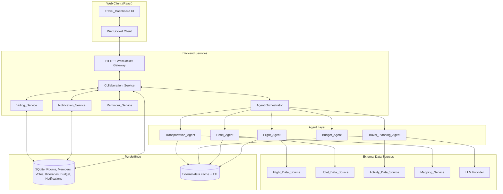
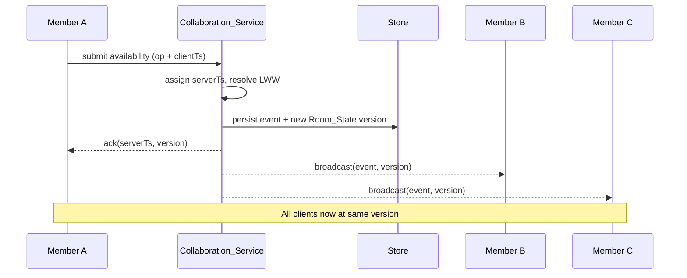
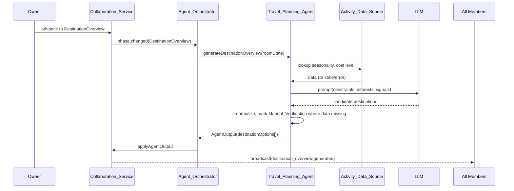

# Design Document

## Overview

The Collaborative Travel Planner is a web application that walks a group of friends through a nine-phase, agent-assisted travel-planning pipeline. Travelers join a shared **Planning_Room** through an **Invite_Link** using only a display name (no account registration), submit availability and destination interests, and progress through Destination Overview → Destination Voting → Flight Selection → Accommodation Selection → Preference Collection → AI Itinerary Planning → Review → Final Plan.

The design intentionally consolidates planning logic into a single **Travel_Planning_Agent** that handles destination overviews, preference interpretation, itinerary generation, activity validation, booking feasibility checks, conflict detection, and replanning. Four specialized agents handle data-heavy domains: **Flight_Agent**, **Hotel_Agent**, **Budget_Agent**, **Transportation_Agent**. Group decisions are mediated by a **Voting_Service**, real-time updates by a **Collaboration_Service** (WebSocket layer), and timing by a **Reminder_Service** and **Notification_Service**.

### Design Goals

- **Hackathon-friendly**: Minimal moving parts, no auth UI, in-memory + lightweight persistence.
- **Resilient to flaky data**: Every external data source can mark fields as `Manual_Verification` instead of guessing.
- **Real-time and recoverable**: Sub-2-second broadcast of room edits, reconnect-and-resync via change log.
- **Agent transparency**: Every Travel_Planning_Agent change to an itinerary item carries a short reason string.
- **Deterministic group decisions**: Voting and phase progression follow well-defined, testable rules.

### Proposed Tech Stack (illustrative)

| Layer | Choice | Rationale |
| --- | --- | --- |
| Frontend | React + TypeScript + Vite + Tailwind | Fast hackathon setup, strong typing for Room_State |
| Real-time | Socket.IO over WebSockets | Battle-tested rooms/namespaces, fallback transport |
| Backend | Node.js + TypeScript + Fastify | Shares types with frontend, easy WebSocket integration |
| Persistence | SQLite (via Prisma) | Zero-ops, file-backed, sufficient for hackathon |
| LLM | OpenAI or Anthropic chat completions | Used by Travel_Planning_Agent |
| Flight data | Amadeus Self-Service or Skyscanner (with fallback to manual) | Public sandbox tiers |
| Hotel data | Amadeus Hotel Search or Booking partner API (manual fallback) | Same vendor as flights reduces auth surface |
| Activity data | Google Places / Foursquare | Opening hours + ratings |
| Mapping | Google Maps Directions API | Turn-by-turn links |

The architecture below does not depend on this specific stack; any equivalent set with WebSocket support and an LLM works.

## Architecture

### High-Level Architecture



### Phase-Driven Pipeline

```mermaid
stateDiagram-v2
    [*] --> AvailabilityAndDestinationInput
    AvailabilityAndDestinationInput --> DestinationOverview: Owner advances
    DestinationOverview --> DestinationVoting: Owner advances
    DestinationVoting --> FlightSelection: Winning destination locked
    FlightSelection --> AccommodationSelection: Flight selected
    AccommodationSelection --> PreferenceCollection: Hotel selected
    PreferenceCollection --> AIItineraryPlanning: Preferences submitted
    AIItineraryPlanning --> Review: Itinerary generated
    Review --> FinalPlan: Critical warnings cleared
    FinalPlan --> [*]

    note right of FinalPlan
      No further advancement.
      Owner may archive (read-only).
    note end note

    Review --> AIItineraryPlanning: Owner reverts
    FinalPlan --> Review: Owner reverts (before archive)
```

Each transition is owner-gated, and reverting a phase marks downstream artifacts (itinerary, budget projections, transportation routes) as `requires_regeneration` so the Travel_Dashboard renders them as draft until reprocessed.

### Real-Time Collaboration Strategy

The Collaboration_Service is the single authority for Room_State. Clients never write directly to peers; every mutation flows server → broadcast.



**Concurrency model:** Every mutation produces an `Event { id, roomId, version, serverTs, actorId, type, payload }`. The server assigns a monotonically increasing `version` per room and a server-side `serverTs`. Conflict resolution is last-write-wins by `serverTs` for non-vote fields. Votes are append-only and immutable after submission. On reconnect, a client sends its last known `version`; the server replays all events `> version` in order.

**Heartbeat:** Each client sends a `heartbeat` every 10s. A member is marked offline after 30s without one, at which point a `presence.offline` event is broadcast.

### Agent Orchestration

The Agent Orchestrator is a thin coordinator that listens for phase transitions and Room_State events and dispatches work to the right agent. Agents are stateless workers; they read Room_State, call external data sources or the LLM, and emit `AgentOutput` events back into the Collaboration_Service.



The Travel_Planning_Agent calls into the LLM with a structured prompt template and validates the response against a JSON schema before applying it. If validation fails it retries once, then falls back to a `Manual_Verification` placeholder result rather than blocking the room.

### Manual Verification Strategy

Every field sourced from an external API carries a `verification: "confirmed" | "manual_verification"` flag and a `retrievedAt` timestamp. A field becomes `manual_verification` when:

- The external API call fails or times out
- The retrieved data is older than the per-source TTL (default 24h)
- The API explicitly returns `unconfirmed` / `estimated`
- A required attribute (price, opening hours) is missing

`Manual_Verification` items remain in the UI and exports but are visually distinguished, and the Review phase requires owner acknowledgement before reaching Final Plan.

## Components and Interfaces

This section enumerates each service / agent, its responsibilities, and the key methods or messages it exposes. Method signatures are illustrative TypeScript and represent the logical contract, not framework specifics.

### Collaboration_Service

Owns Room_State, membership, phase, and event log. Brokers all real-time updates.

```ts
interface CollaborationService {
  createRoom(input: { tripName: string; ownerDisplayName: string; maxMembers?: number }): Promise<{ room: PlanningRoom; inviteLink: string; ownerSession: GuestSession }>
  joinRoom(input: { inviteToken: string; displayName: string }): Promise<{ room: PlanningRoom; session: GuestSession }>
  advancePhase(roomId: string, actorId: string): Promise<PlanningPhase>
  revertPhase(roomId: string, actorId: string, targetPhase: PlanningPhase): Promise<PlanningPhase>
  applyEvent(roomId: string, event: RoomEvent): Promise<{ version: number; serverTs: number }>
  syncSince(roomId: string, sessionId: string, lastVersion: number): Promise<RoomEvent[]>
  getRoomState(roomId: string): Promise<RoomState>
}
```

Responsibilities:
- Validate inputs (display name length, trip name length, max members)
- Enforce phase order (Req 2.1) and owner-only progression (Req 2.3)
- Mark previous phases read-only (Req 2.4) and downstream artifacts dirty on revert (Req 2.5)
- Persist `RoomEvent` log and broadcast to connected sockets (Req 11.1)
- Track member presence with 30s heartbeat (Req 11.2, 11.5)
- Queue events during disconnect (Req 11.6) and replay on reconnect (Req 11.3)
- Resolve concurrent edits via last-write-wins on `serverTs` except for votes (Req 11.4)

### Voting_Service

Owns polls, vote casting, and tally logic.

```ts
interface VotingService {
  createPoll(input: { roomId: string; createdBy: string; question: string; options: string[]; deadline?: number; context?: PollContext }): Promise<Poll>
  castVote(input: { pollId: string; memberId: string; optionId: string }): Promise<void>
  closePoll(pollId: string): Promise<PollResult>
  getPoll(pollId: string): Promise<Poll>
}
```

Responsibilities:
- Reject polls with `options.length < 2 || options.length > 10` (Req 5.6)
- One immutable vote per member per poll (Req 5.2)
- Auto-close on full participation or deadline (Req 5.3)
- Determine winner by simple majority (Req 5.4)
- Auto-create tiebreaker poll containing only tied options (Req 5.5)
- Reveal vote counts but not choices while active (Req 5.7)
- Notify Travel_Planning_Agent when an agent-requested poll closes (Req 5.9)

`PollContext` discriminates whether the poll is a destination selection, flight choice, hotel choice, conflict resolution, or tiebreaker, so downstream services can react appropriately.

### Travel_Planning_Agent

Combined agent responsible for destination overview, preference interpretation, itinerary generation, validation, conflict detection, and replanning.

```ts
interface TravelPlanningAgent {
  generateDestinationOverview(state: RoomState): Promise<DestinationOption[]>
  structurePreferences(state: RoomState): Promise<StructuredPreferences>
  detectConflicts(prefs: StructuredPreferences): Promise<PreferenceConflict[]>
  generateItinerary(state: RoomState): Promise<Itinerary>
  validateItinerary(itinerary: Itinerary, state: RoomState): Promise<ItineraryWarning[]>
  replanFromEvent(event: RoomEvent, currentItinerary: Itinerary, state: RoomState): Promise<ItineraryDiff>
  buildFinalSummary(state: RoomState): Promise<FinalItinerarySummary>
}
```

Internally the agent has three submodules wired around a shared LLM client:

1. **Destination submodule** – builds a constraint matrix (overlap windows, budget bands, interest tags, seasonality) and prompts the LLM for 3–8 candidates, then normalizes with `Activity_Data_Source` info to mark Manual_Verification fields.
2. **Preference submodule** – categorizes free-text into `attractions, food, shopping, nightlife, nature, culture, activities, accommodation_area, transportation, constraints` and tags each item as `must_have | nice_to_have | avoid`.
3. **Itinerary submodule** – builds a day-by-day plan honoring selected flights' arrival/departure times, hotel location, opening hours, and travel time between items. Each `ItineraryItem` carries a `reason` field; replans diff against the prior version and emit `ItineraryItemChange` events with a human-readable explanation (Req 4.16).

The agent enforces a 90-second SLO for first itinerary generation (Req 4.11) and a 30-second SLO for incremental replans (Req 4.15), both timeboxed via `AbortController`. On timeout it returns a partial itinerary with `Manual_Verification` flags rather than failing.

When two equally feasible itinerary options exist for the same conflict, the agent emits a `requestVote` AgentOutput rather than choosing silently (Req 4.19); the Agent Orchestrator forwards this to Voting_Service.

The agent preserves a `version` count per itinerary; the Travel_Dashboard exposes a "Compare to previous" view (Req 4.17).

### Flight_Agent

```ts
interface FlightAgent {
  fetchFlightOptions(input: { destination: string; window: DateRange; passengers: number }): Promise<FlightOption[]>
  rankFlights(options: FlightOption[]): RankedFlightGroups
}

interface RankedFlightGroups {
  budget: FlightOption[]
  comfort: FlightOption[]
  bestValue: FlightOption[]
}
```

Ranking score per requirement 6.4:

```
score(f) = 0.4 * normalize_price(f) + 0.3 * normalize_duration(f) + 0.2 * normalize_stops(f) + 0.1 * normalize_schedule_convenience(f)
```

Where each `normalize_*` returns a value in `[0,1]` with `1` being best (cheapest, fastest, fewest stops, most convenient hours). Categorization:

- **Budget**: top-K by `normalize_price`
- **Comfort**: top-K by `0.5 * normalize_duration + 0.3 * normalize_stops + 0.2 * normalize_schedule_convenience`
- **Best Value**: top-K by the composite score above

If the data source returns no results, the agent emits a `dataUnavailable` event so the Owner can retry with adjusted dates / airports or enter manual flight details (Req 6.5, 6.7). The agent never marks a price or seat as guaranteed unless the source explicitly says so (Req 6.8).

### Hotel_Agent

```ts
interface HotelAgent {
  fetchAccommodationOptions(input: { destination: string; dates: DateRange; groupSize: number; flightArrival?: DateTime; suggestedAreas?: GeoCluster[] }): Promise<AccommodationOption[]>
  rankAccommodations(options: AccommodationOption[]): RankedAccommodationGroups
  recommendAreas(destination: string): Promise<AreaRecommendation[]>
}
```

Ranking score per requirement 7.4:

```
score(h) = 0.35 * normalize_location_convenience(h) + 0.25 * normalize_price(h) + 0.20 * normalize_rating(h) + 0.20 * normalize_comfort(h)
```

`normalize_location_convenience` uses average travel time from the property to the `GeoCluster` centroids supplied by the Travel_Planning_Agent (Req 7.6). When fewer than three options sit near the suggested clusters, the agent returns whatever is available and recommends the nearest viable neighborhoods (Req 7.7). All staleness/availability rules from Flight_Agent apply analogously (Req 7.8, 7.10, 7.11).

### Budget_Agent

```ts
interface BudgetAgent {
  recordEstimate(roomId: string, category: BudgetCategory, amount: Money, source: BudgetSource): Promise<BudgetSnapshot>
  recordSpending(roomId: string, record: SpendingRecord): Promise<BudgetSnapshot>
  projectRemaining(roomId: string): Promise<BudgetProjection>
  evaluateRisk(snapshot: BudgetSnapshot, projection: BudgetProjection): BudgetRiskAssessment
  suggestCheaperAlternatives(roomId: string): Promise<ActivityAlternative[]>
}
```

The Budget_Agent maintains five categories: `accommodation, food, transportation, activities, miscellaneous`. Spending validation rejects missing amounts, negative amounts, and currencies not in the supported set (Req 8.8). Risk detection follows the rule:

```
projected_total > allocated_budget * 1.10  ⇒  BudgetRisk
```

When risk is flagged, it returns up to N alternatives each costing ≥20% less than the originally planned activity, or all that exist if fewer (Req 8.3, 8.4). Updates propagate to the dashboard within 5 seconds via Collaboration_Service broadcasts (Req 8.1, 8.6, 8.7).

### Transportation_Agent

```ts
interface TransportationAgent {
  computeDailyRoutes(itinerary: Itinerary): Promise<DailyRoutePlan[]>
  rankTransportOptions(origin: Location, destination: Location): Promise<RankedTransportOptions>
  handleDisruption(event: DisruptionEvent, itinerary: Itinerary): Promise<RoutePlanDiff>
  emitCostUpdates(plan: DailyRoutePlan[]): TransportCostUpdate[]
}
```

Ranking per requirement 9.2:

```
score(t) = 0.4 * normalize_time(t) + 0.4 * normalize_cost(t) + 0.2 * normalize_transfers(t)
```

The agent returns up to 5 ranked options per leg, calls `Mapping_Service` for turn-by-turn links, and falls back to text directions if the mapping provider is down (Req 9.4, 9.6). Disruptions trigger a recompute that completes within 60 seconds and notify affected members (Req 9.3). The agent emits transport-cost events to Budget_Agent within 5 seconds (Req 9.8).

### Notification_Service

```ts
interface NotificationService {
  publish(notification: Notification): Promise<void>
  feedFor(memberId: string, roomId: string): Promise<Notification[]>
  markRead(memberId: string, notificationIds: string[]): Promise<void>
}
```

Triggers per Requirement 14:

| Event | Audience | SLO |
| --- | --- | --- |
| Phase transition | All members | 30s |
| Vote initiated | All members | immediate |
| Vote reminder (50% deadline elapsed) | Non-voters | when threshold met |
| Budget_Risk flagged | All members | 30s |
| Transport disruption alt-routes | Affected members | 30s |
| Activity flagged (closed / Manual_Verification) | All members | 30s |
| Hotel/Flight option Manual_Verification | All members | 30s |

Notifications are stored, marked read on view, and visually distinguished (Req 14.10). No email path is implemented (Req 14.11).

### Reminder_Service

```ts
interface ReminderService {
  setPromptWindow(input: { roomId: string; phase: PlanningPhase; deadline: number }): Promise<PromptWindow>
  getPendingTasks(memberId: string, roomId: string): Promise<PendingTask[]>
  evaluateReminders(now: number): Promise<ReminderTrigger[]>
}
```

Runs a periodic tick (e.g. every 30s) that:
- Sends an in-app reminder to any member who has not completed required input once `elapsed >= 0.5 * total_window` (Req 10.3, 14.3)
- Notifies the owner of incomplete inputs when a deadline is reached (Req 10.4)
- Lets the owner proceed with available inputs after deadline; missing inputs are recorded in Room_State (Req 10.5)
- Hydrates a "pending tasks" view for the current phase on rejoin within 5 seconds (Req 10.6)

### Travel_Dashboard (Frontend)

The dashboard is composed of phase-aware panels driven by a single `RoomState` Redux/Zustand store hydrated from `syncSince` and updated by incoming WebSocket events.

Panels:
- **PhaseHeader**: current phase, allowed actions, completion percentages per member (Req 12.1, 12.2)
- **AvailabilityPanel** (phase 1)
- **DestinationOverviewPanel** (phase 2) – shows agent output with `Manual_Verification` badges
- **VotingPanel** – embedded in phases 3, 4, 5, 7
- **FlightComparisonPanel** (phase 4) – three categories side-by-side
- **AccommodationPanel** (phase 5)
- **PreferencePanel** (phase 6)
- **ItineraryPanel** (phases 7, 8, 9) – day-by-day, version compare, change reasons
- **BudgetPanel** – always visible after phase 5
- **TransportationPanel** – always visible after phase 7
- **WarningsTray** – aggregates Manual_Verification, Budget_Risk, unavailable items (Req 12.4)
- **NotificationsFeed** (Req 14.9)
- **ExportPanel** (phase 9) – Markdown / PDF / plain text (Req 13.4)

Status updates are throttled to render at most once every 250ms but must reflect underlying changes within 5 seconds (Req 12.3).

### External Integrations

| Integration | Used by | Caching | Fallback |
| --- | --- | --- | --- |
| Flight_Data_Source | Flight_Agent | 6h TTL keyed by (origin, dest, dates, pax) | Manual_Verification + manual entry form |
| Hotel_Data_Source | Hotel_Agent | 12h TTL keyed by (dest, dates, group) | Manual_Verification + manual entry form |
| Activity_Data_Source | Travel_Planning_Agent | 24h TTL keyed by place_id | Manual_Verification on item |
| Mapping_Service | Transportation_Agent | 24h TTL keyed by (origin, dest, mode) | Text-only directions |
| LLM | Travel_Planning_Agent | none (deterministic on retry via seed where supported) | Reduced-fidelity output + Manual_Verification |

All external clients implement: timeout (default 8s), one retry with jitter, circuit breaker after 5 consecutive failures, and a `verification` flag on returned records.

## Data Models

### Core Identity

```ts
type GuestSession = {
  id: string                    // UUID
  roomId: string
  displayName: string           // 2–50 chars
  isOwner: boolean
  createdAt: number
  lastSeenAt: number
}

type PlanningRoom = {
  id: string                    // UUID
  tripName: string              // 1–100 chars
  inviteToken: string           // URL-safe random
  maxMembers: number            // 2–20, default 20
  phase: PlanningPhase
  archived: boolean
  createdAt: number
  ownerSessionId: string
}

type PlanningPhase =
  | "availability_and_destination_input"
  | "destination_overview"
  | "destination_voting"
  | "flight_selection"
  | "accommodation_selection"
  | "preference_collection"
  | "ai_itinerary_planning"
  | "review"
  | "final_plan"
```

### Room State

`RoomState` is the projection materialized from the event log. Each top-level field is updated by replaying events.

```ts
type RoomState = {
  room: PlanningRoom
  members: Member[]
  availability: Record<MemberId, AvailabilityRange[]>
  destinationInterests: Record<MemberId, InterestEntry[]>
  constraints: Record<MemberId, TripConstraints>
  destinationOptions: DestinationOption[]              // from Travel_Planning_Agent
  selectedDestination?: SelectedDestination
  flightOptions?: RankedFlightGroups
  selectedFlight?: SelectedFlight
  accommodationOptions?: RankedAccommodationGroups
  selectedAccommodation?: SelectedAccommodation
  preferences: Record<MemberId, RawPreferenceInput>
  structuredPreferences?: StructuredPreferences
  preferenceConflicts: PreferenceConflict[]
  itineraryVersions: Itinerary[]                       // most recent last
  budget: BudgetSnapshot
  transportPlan?: DailyRoutePlan[]
  reminders: PromptWindow[]
  notificationsByMember: Record<MemberId, Notification[]>
  warnings: Warning[]
  version: number
  updatedAt: number
}
```

### Availability and Interest

```ts
type AvailabilityRange = {
  start: ISODate                // inclusive
  end: ISODate                  // inclusive, must be ≥ start
  priority?: "low" | "medium" | "high"
}

type InterestEntry = {
  kind: "country" | "city" | "region" | "theme"
  value: string
}

type TripConstraints = {
  budgetRange?: { min: number; max: number; currency: string }
  preferredDurationDays?: number
  pace?: "relaxed" | "balanced" | "packed"
  dietary?: string[]
  accessibility?: string[]
  travelStyle?: string[]
}
```

### Destination / Flights / Hotels

```ts
type DestinationOption = {
  id: string
  name: string
  travelWindow: DateRange
  reason: string
  suitabilityScore: number               // 0..1
  estimatedCostLevel: "low" | "medium" | "high" | "manual_verification"
  weatherNotes: string | "manual_verification"
  majorTouristAreas: string[]
  flightFeasibility: string | "manual_verification"
  retrievedAt: number
  verification: Verification
}

type FlightOption = {
  id: string
  airline: string
  fromAirport: string
  toAirport: string
  departure: ISODateTime
  arrival: ISODateTime
  durationMinutes: number
  stops: number
  baggage?: string
  estimatedPrice?: Money
  bookingLink?: string
  retrievedAt: number
  verification: Verification
}

type AccommodationOption = {
  id: string
  name: string
  accommodationType: "hotel" | "hostel" | "apartment" | "other"
  neighborhood: string
  totalPrice?: Money
  perTravelerPrice?: Money
  rating?: number
  amenities: string[]
  distanceToSuggestedAreas?: Record<string, number>   // km per cluster
  bookingLink?: string
  cancellationFlexibility?: "flexible" | "moderate" | "strict" | "unknown"
  retrievedAt: number
  verification: Verification
}

type Verification = "confirmed" | "manual_verification"
```

### Preferences and Conflicts

```ts
type RawPreferenceInput = {
  freeText: string
  submittedAt: number
}

type StructuredPreferences = {
  byMember: Record<MemberId, PreferenceCategorized>
  global: PreferenceCategorized                     // union view
}

type PreferenceCategorized = {
  attractions: PreferenceItem[]
  food: PreferenceItem[]
  shopping: PreferenceItem[]
  nightlife: PreferenceItem[]
  nature: PreferenceItem[]
  culture: PreferenceItem[]
  activities: PreferenceItem[]
  accommodation_area: PreferenceItem[]
  transportation: PreferenceItem[]
  constraints: PreferenceItem[]
}

type PreferenceItem = {
  id: string
  value: string
  strength: "must_have" | "nice_to_have" | "avoid"
  source: MemberId
}

type PreferenceConflict = {
  id: string
  type: "time" | "budget" | "location" | "availability" | "disagreement"
  involvedItems: string[]                            // PreferenceItem ids
  proposedCompromise?: string
  resolution: { kind: "compromise" } | { kind: "vote"; pollId: string } | { kind: "unresolved" }
}
```

### Itinerary

```ts
type Itinerary = {
  version: number
  generatedAt: number
  days: ItineraryDay[]
  changeLog: ItineraryItemChange[]                  // diff vs previous version
  unsatisfiedMustHaves?: UnsatisfiedPreference[]    // Req 4.18
}

type ItineraryDay = {
  date: ISODate
  items: ItineraryItem[]
}

type ItineraryItem = {
  id: string
  name: string
  date: ISODate
  startTime: ISOTime
  endTime: ISOTime
  location: Location
  estimatedCost?: Money
  bookingRequired?: boolean
  openingHourStatus?: "open" | "closed" | "unknown" | "manual_verification"
  preferenceSource?: PreferenceItem["id"]
  travelSegmentToNext?: TravelSegment
  verification: Verification
  status: "draft" | "confirmed" | "flagged" | "removed"
  reason?: string                                    // Req 4.16: why the agent placed/changed it
}

type ItineraryItemChange = {
  itemId: string
  kind: "added" | "removed" | "replaced" | "moved" | "flagged"
  reason: string
  previousValue?: Partial<ItineraryItem>
  newValue?: Partial<ItineraryItem>
}

type UnsatisfiedPreference = {
  preferenceId: string
  reason: "time" | "distance" | "budget" | "opening_hours" | "booking_unavailable" | "missing_data"
}
```

### Voting

```ts
type Poll = {
  id: string
  roomId: string
  question: string
  options: PollOption[]                              // 2..10
  createdBy: MemberId
  createdAt: number
  deadline?: number
  context: PollContext
  status: "open" | "closed"
  closedAt?: number
}

type PollOption = { id: string; label: string; metadata?: Record<string, unknown> }

type Vote = {
  pollId: string
  memberId: MemberId
  optionId: string
  castAt: number
}

type PollResult = {
  pollId: string
  tally: Record<string /* optionId */, number>
  totalVotes: number
  winner?: string                                    // optionId, absent on tie
  tied?: string[]                                    // tied optionIds when no winner
  tiebreakerPollId?: string
}

type PollContext =
  | { kind: "destination" }
  | { kind: "flight" }
  | { kind: "accommodation" }
  | { kind: "preference_conflict"; conflictId: string }
  | { kind: "itinerary_choice"; itineraryChoiceId: string }
  | { kind: "tiebreaker"; parentPollId: string }
```

### Budget

```ts
type BudgetCategory = "accommodation" | "food" | "transportation" | "activities" | "miscellaneous"

type Money = { amount: number; currency: SupportedCurrency }   // amount ≥ 0

type SpendingRecord = {
  id: string
  category: BudgetCategory
  amount: Money
  date: ISODate
  plannedActivityId?: string
  memberId: MemberId
}

type BudgetSnapshot = {
  total: Money
  estimatedByCategory: Record<BudgetCategory, Money>
  actualByCategory: Record<BudgetCategory, Money>
  remaining: Money
  updatedAt: number
}

type BudgetProjection = {
  projectedTotal: Money
  perCategoryProjection: Record<BudgetCategory, Money>
  dailyRateByCategory: Record<BudgetCategory, number>
}

type BudgetRiskAssessment = {
  atRisk: boolean
  overAllocatedBy?: Money
  alternatives: ActivityAlternative[]
}
```

### Transportation

```ts
type TransportMode = "walk" | "transit" | "drive" | "rideshare" | "bike" | "rail" | "flight"

type TransportOption = {
  id: string
  mode: TransportMode
  durationMinutes: number
  estimatedCost?: Money
  transfers: number
  mappingLink?: string
  textDirections?: string
}

type DailyRoutePlan = {
  date: ISODate
  legs: RouteLeg[]
}

type RouteLeg = {
  fromItemId: string
  toItemId: string
  rankedOptions: TransportOption[]                  // up to 5
}
```

### Events and Notifications

```ts
type RoomEvent = {
  id: string
  roomId: string
  version: number                                   // assigned by server
  serverTs: number                                  // assigned by server
  actorId: MemberId | "system"
  type: RoomEventType
  payload: unknown
}

type RoomEventType =
  | "member.joined" | "member.left" | "presence.online" | "presence.offline"
  | "phase.advanced" | "phase.reverted"
  | "availability.upserted" | "interest.upserted" | "constraints.upserted"
  | "destination_overview.generated" | "destination.selected"
  | "flight_options.generated" | "flight.selected"
  | "accommodation_options.generated" | "accommodation.selected"
  | "preference.upserted" | "preferences.structured"
  | "itinerary.generated" | "itinerary.changed"
  | "vote.created" | "vote.cast" | "vote.closed"
  | "budget.updated" | "budget.risk_flagged"
  | "transport.updated" | "transport.disruption_handled"
  | "notification.posted" | "notification.read"
  | "warning.added" | "warning.resolved"

type Notification = {
  id: string
  roomId: string
  audience: "all" | MemberId[]
  kind: NotificationKind
  body: string
  link?: string
  createdAt: number
  readBy: MemberId[]
}
```

### Final Plan Export

```ts
type FinalItinerarySummary = {
  tripName: string
  tripDates: DateRange
  destination: SelectedDestination
  flight: SelectedFlight
  accommodation: SelectedAccommodation
  dailySchedule: ItineraryDay[]
  routePlan: DailyRoutePlan[]
  budget: BudgetSnapshot
  bookingLinks: { label: string; url: string }[]
  manualVerificationNotes: string[]
  unresolvedWarnings: Warning[]                     // Req 13.5
  disclaimer: string                                // Req 13.8
}

type ExportFormat = "markdown" | "plain_text" | "table" | "pdf"
```


## Correctness Properties

*A property is a characteristic or behavior that should hold true across all valid executions of a system — essentially, a formal statement about what the system should do. Properties serve as the bridge between human-readable specifications and machine-verifiable correctness guarantees.*

The following properties were derived from the acceptance criteria prework and consolidated to eliminate redundancy. Each is a universal ("for any …") statement that can be implemented as a property-based test.

### Property 1: Room creation initializes a valid, uniquely identifiable room

*For any* valid `tripName` (1–100 chars), `ownerDisplayName` (2–50 chars), and optional `maxMembers` in [2, 20], the resulting `PlanningRoom` has exactly one member who is the owner, `phase = availability_and_destination_input`, an `inviteToken` distinct from every other concurrently created room, and a `maxMembers` value in [2, 20] (defaulting to 20 when omitted).

**Validates: Requirements 1.1, 1.2, 1.5**

### Property 2: Domain inputs outside their valid ranges are rejected

*For any* input value submitted to a domain-validated endpoint, the system accepts it iff it lies within its declared range, and otherwise rejects it without mutating Room_State:

- `displayName` length ∈ [2, 50]
- `tripName` length ∈ [1, 100]
- `maxMembers` ∈ [2, 20]
- `AvailabilityRange.end ≥ AvailabilityRange.start`
- Poll `options.length` ∈ [2, 10]
- `SpendingRecord.amount > 0` and `currency ∈ SupportedCurrency`

**Validates: Requirements 1.5, 1.8, 3.7, 5.6, 8.8**

### Property 3: Capacity rule

*For any* `PlanningRoom` whose current member count equals its `maxMembers`, the next `joinRoom` attempt is rejected with a `room_full` error and the member set is unchanged.

**Validates: Requirements 1.7**

### Property 4: Phase progression state machine

*For any* `RoomState` and any actor:

- `advancePhase(currentPhase)` returns exactly the unique successor in the defined sequence (Availability → ... → Final Plan), and returns no transition when `currentPhase = final_plan`.
- The transition is accepted iff the actor is the room owner.
- After a successful advance, all fields owned by prior phases are read-only; mutations to them are rejected.
- After a `revertPhase(target)`, the target phase becomes editable and every downstream-derived artifact (`itineraryVersions[latest]`, `transportPlan`, projected budget) is marked `requires_regeneration`.

**Validates: Requirements 2.1, 2.3, 2.4, 2.5, 2.8**

### Property 5: Availability overlap correctness

*For any* set of per-member `AvailabilityRange[]` submissions, the computed group overlap equals the set-theoretic intersection of each member's union of ranges. *For any* input with no full overlap, the system returns (a) the maximal partial overlap window and (b) exactly the set of members whose ranges exclude that window.

**Validates: Requirements 3.4, 3.6**

### Property 6: External-field verification correctness

*For any* field returned by an external data source (flights, hotels, activities, mapping, weather, pricing), the field is marked `confirmed` if and only if the source explicitly confirmed it AND `now − retrievedAt ≤ ttl(source)`; otherwise it is marked `manual_verification`. No agent output reports a value as guaranteed if its source verification is `manual_verification`.

**Validates: Requirements 4.4, 4.14, 6.3, 6.5, 6.8, 7.3, 7.8, 7.11**

### Property 7: Preference categorization is total and disjoint

*For any* `PreferenceItem` produced by the preference structuring submodule, the item belongs to exactly one category in `{attractions, food, shopping, nightlife, nature, culture, activities, accommodation_area, transportation, constraints}` and carries a `strength` in `{must_have, nice_to_have, avoid}`.

**Validates: Requirements 4.6**

### Property 8: Preference conflict detection and resolution shape

*For any* set of structured preferences, every detected `PreferenceConflict` carries a non-empty `involvedItems` list and a `resolution` of kind `compromise` or `vote` (i.e., never both absent). Conversely, any duplicate or contradictory pair present in the input must appear in at least one detected conflict.

**Validates: Requirements 4.7, 4.8**

### Property 9: Generated itinerary covers every trip day with valid items

*For any* trip date range and selected travel context, the generated `Itinerary.days` contains exactly one `ItineraryDay` per date in the range, in order and without gaps. *For any* `ItineraryItem` produced, all required fields (`name`, `date`, `startTime`, `endTime`, `location`, `status`) are populated; `endTime > startTime`; and the day's items are non-overlapping in time.

**Validates: Requirements 4.9, 4.10**

### Property 10: Flagged items carry an alternative or a reason

*For any* `ItineraryItem` whose `status = flagged` (closed, unavailable, or not bookable), the agent's response includes either at least one alternative item targeting the same preference source or date, or — if no alternative is feasible — a non-empty explanation in the item's `reason` field.

**Validates: Requirements 4.13**

### Property 11: Every itinerary change carries an explanation

*For any* `ItineraryItemChange` emitted by the Travel_Planning_Agent during replanning, the `reason` field is a non-empty string.

**Validates: Requirements 4.16**

### Property 12: Itinerary version history is preserved and append-only

*For any* sequence of N itinerary generations within a room, `itineraryVersions.length = N`, versions appear in generation order, and every prior version is byte-identical to its value at the moment it was generated.

**Validates: Requirements 4.17**

### Property 13: Unsatisfied must-haves are reported with categorized reasons

*For any* itinerary where one or more `must_have` preferences are not satisfied, the response's `unsatisfiedMustHaves` list contains exactly those preferences, each tagged with a reason in `{time, distance, budget, opening_hours, booking_unavailable, missing_data}`.

**Validates: Requirements 4.18**

### Property 14: Equally feasible itinerary alternatives trigger a vote

*For any* pair of candidate itinerary variants whose feasibility scores are equal (within a tolerance ε), the Travel_Planning_Agent emits a `requestVote` AgentOutput rather than choosing silently. The created poll's options correspond exactly to the tied variants.

**Validates: Requirements 4.19**

### Property 15: Voting outcome correctness

*For any* poll with options O and votes V cast by distinct members:

- The poll is created iff `2 ≤ |O| ≤ 10`.
- A member's vote is recorded at most once; subsequent change attempts are rejected.
- The poll closes when `|V| = |members|` or `now ≥ deadline`, whichever first.
- The winner equals `argmax(tally)` when unique; otherwise no winner is set, and `tied[]` equals the set of all options sharing the maximum tally.
- If a tie occurs, a tiebreaker poll is auto-created whose option set equals `tied[]`.
- While the poll is open, only aggregate counts are visible; per-member optionIds are revealed only after closure.

**Validates: Requirements 5.1, 5.2, 5.3, 5.4, 5.5, 5.6, 5.7**

### Property 16: Flight ranking correctness

*For any* non-empty list `F` of `FlightOption`s, `rankFlights(F)`:

- Returns three non-empty groups `{budget, comfort, bestValue}`.
- The `bestValue` group is sorted by descending composite score `s(f) = 0.4·n_price(f) + 0.3·n_duration(f) + 0.2·n_stops(f) + 0.1·n_schedule(f)`, where each `n_*` normalizes its dimension to [0,1] (1 = best).
- Every option in every group satisfies the `FlightOption` schema with appropriate `verification` flags per Property 6.

**Validates: Requirements 6.2, 6.3, 6.4**

### Property 17: Hotel ranking with location convenience

*For any* non-empty list `H` of `AccommodationOption`s, `rankAccommodations(H)`:

- Returns three non-empty groups `{budget, comfort, bestValue}` when ≥3 options are within suggested clusters; otherwise returns all available options plus a `nearest_alternative_neighborhoods` set.
- The `bestValue` group is sorted by `s(h) = 0.35·n_location(h) + 0.25·n_price(h) + 0.20·n_rating(h) + 0.20·n_comfort(h)`.
- When suggested `GeoCluster` centroids are provided, the ordering prefers options whose `distanceToSuggestedAreas` average is lower (ties broken by composite score).
- Area recommendations are returned for any destination with non-empty reasons.

**Validates: Requirements 7.2, 7.3, 7.4, 7.5, 7.6, 7.7**

### Property 18: Empty external sources emit notification and manual fallback

*For any* Flight_Agent or Hotel_Agent invocation that returns an empty option set, the agent emits a `dataUnavailable` notification and the dashboard exposes a manual-entry action (and, for flights, a retry-with-adjusted-dates suggestion).

**Validates: Requirements 6.7, 7.10**

### Property 19: Budget aggregation and projection arithmetic

*For any* sequence of `SpendingRecord`s applied to an initial `BudgetSnapshot`:

- `actualByCategory[c]` equals the sum of amounts for category `c`.
- `remaining = total − Σ actualByCategory`.
- `projectedTotal = Σ actualByCategory + Σ (dailyRateByCategory[c] · remainingDays[c])`, where `dailyRateByCategory[c] = actualByCategory[c] / max(1, daysElapsedForCategory[c])`.

**Validates: Requirements 8.1, 8.2**

### Property 20: Budget risk threshold and alternative selection

*For any* `BudgetSnapshot` and `BudgetProjection`:

- `atRisk = (projectedTotal > total · 1.10)`.
- When `atRisk` is true and the available alternative pool `A` contains items each at least 20% cheaper than the original, the returned alternatives set has size `min(|A|, 2 or more)` and never exceeds the pool; when `|A| < 2`, all of `A` is returned plus a `limited_alternatives` notification.
- When `Σ actualByCategory > total`, an `over_budget` alert is emitted and every unpaid planned activity is flagged for review.

**Validates: Requirements 8.3, 8.4, 8.5**

### Property 21: Selection events update Budget consistently

*For any* `flight.selected`, `accommodation.selected`, or transport-cost event with price `p` in category `c`, the resulting `BudgetSnapshot.estimatedByCategory[c]` equals the corresponding selection price (or sum, for transportation aggregating leg costs), and `Room_State.selectedFlight` / `selectedAccommodation` / `transportPlan` references the same price.

**Validates: Requirements 6.6, 7.9, 8.7, 9.8**

### Property 22: Transportation ranking truncation and ordering

*For any* leg with candidate options `T`, `rankTransportOptions(T)` returns at most 5 options, sorted by descending `s(t) = 0.4·n_time(t) + 0.4·n_cost(t) + 0.2·n_transfers(t)`.

**Validates: Requirements 9.2**

### Property 23: Transportation fallbacks

*For any* location pair with no routable path, the response includes a notification and a nearest-reachable-alternative entry. *For any* leg computed while `Mapping_Service` is unavailable, every returned `TransportOption` contains a `textDirections` string referencing origin, destination, and mode.

**Validates: Requirements 9.5, 9.6**

### Property 24: Reminder threshold is exactly-once per (member, threshold)

*For any* `PromptWindow` and any tick sequence, `evaluateReminders` emits at most one 50%-threshold reminder per `(member, phase)` pair across all ticks, and emits exactly one when `elapsed ≥ 0.5 · totalWindow` and the member's required input is still incomplete.

**Validates: Requirements 10.3**

### Property 25: Deadline passage allows owner to proceed; missing inputs recorded

*For any* phase whose `PromptWindow` deadline has passed with some members' inputs incomplete, the owner's `advancePhase` is accepted, and `Room_State` records each missing input under a `missing_inputs[phase]` field with member ids. The owner is notified of the incomplete set at deadline.

**Validates: Requirements 10.4, 10.5**

### Property 26: Pending-task derivation is correct

*For any* `RoomState` and any `memberId`, `getPendingTasks(memberId, roomId)` returns exactly the set of inputs required for the current phase that the member has not yet submitted.

**Validates: Requirements 10.6**

### Property 27: Presence is determined by heartbeat freshness

*For any* member and any time `now`, `isOnline(member, now) = (now − member.lastSeenAt ≤ 30s)`.

**Validates: Requirements 11.2**

### Property 28: Event-log replay and conflict resolution converge

*For any* event log `E` and any `lastVersion v`:

- Folding `E[0..]` via the room reducer produces the canonical `RoomState`.
- `syncSince(roomId, v)` returns exactly `E[v+1..]` in version order.
- *For any* two concurrent edits on the same non-vote field, the resulting state equals the one whose `serverTs` is larger.
- A vote event for an already-voted `(pollId, memberId)` is rejected; the tally is unchanged.
- An offline client's queued events, when applied on reconnect, converge to the same canonical state as if they had been applied online (LWW invariant preserved).
- When the agent regenerates an output, prior dependent outputs are marked `superseded` in the new log entry.

**Validates: Requirements 2.7, 11.3, 11.4, 11.6, 11.7**

### Property 29: Critical warnings gate the Final Plan transition

*For any* `Room_State` with at least one unresolved critical warning (an unavailable activity, missing selected flight, missing selected accommodation, or over-budget alert), `advancePhase(review → final_plan)` is rejected; conversely, when no such warnings remain, the transition is accepted.

**Validates: Requirements 4.20, 13.2**

### Property 30: Final summary schema, warnings, and disclaimer

*For any* `Room_State` that has reached the Final Plan phase, the generated `FinalItinerarySummary` contains every required field (`tripDates`, `destination`, `flight`, `accommodation`, `dailySchedule`, `routePlan`, `budget`, `bookingLinks`, `manualVerificationNotes`), includes the current `unresolvedWarnings`, and includes the standard `disclaimer` string.

**Validates: Requirements 13.3, 13.5, 13.8**

### Property 31: Export round-trip preserves structure

*For any* `FinalItinerarySummary`, exporting to Markdown (or another supported structured format) and parsing the result back yields a `FinalItinerarySummary` structurally equal to the original on all schema fields (`tripDates`, `destination`, `flight`, `accommodation`, `dailySchedule`, `routePlan`, `budget`, `unresolvedWarnings`, `disclaimer`).

**Validates: Requirements 13.4**

### Property 32: Archived room is read-only and field-preserving

*For any* room with `archived = true`, every mutation attempt is rejected and `getRoomState` returns the same final itinerary, votes, preferences, selected accommodation, budget records, and transportation details as at the moment of archival.

**Validates: Requirements 13.6**

### Property 33: Notification triggers match the trigger table

*For any* qualifying event (phase transition, vote initiated, 50% poll-deadline reminder, budget-risk flag, transport disruption alt-routes, activity flagged, hotel option flagged, flight option flagged), exactly one notification is published with the audience and `kind` defined in the notification trigger table. No notification is emitted for non-qualifying events.

**Validates: Requirements 14.1, 14.2, 14.3, 14.4, 14.5, 14.6, 14.7, 14.8**

### Property 34: Notification feed ordering and read state

*For any* sequence of notifications stored for a room, `feedFor(memberId, roomId)` returns them sorted by `createdAt` descending. For any `markRead(memberId, ids)` call, every id in `ids` thereafter contains `memberId` in its `readBy` set; the operation is idempotent.

**Validates: Requirements 14.9, 14.10**

### Property 35: Completion percentage formula

*For any* member and phase, the displayed completion percentage equals `floor(100 · completed_required_inputs / total_required_inputs)`; when `total_required_inputs = 0`, the percentage is 100.

**Validates: Requirements 12.2**

### Property 36: Manual fallback availability on data-source errors

*For any* `RoomState` where an agent output is marked `manual_verification` or a data-source error event has been recorded, the dashboard view model exposes a `retry` or `manual_entry` action for the corresponding section.

**Validates: Requirements 12.6**

## Error Handling

Errors are categorized into five domains, each with a defined recovery strategy. Every error is logged with a correlation id (`roomId`, `eventId`) and surfaced to the dashboard via a typed `Warning` or `Notification` so the user always knows what failed and what to do.

### Input Validation Errors (4xx)

Invalid display name, trip name, date range, poll options, spending record, or out-of-range numeric input is rejected synchronously with a structured error:

```json
{ "code": "validation_error", "field": "displayName", "reason": "length_out_of_range", "expected": "2-50 chars" }
```

The client renders the error inline on the offending form field. No Room_State is mutated. Covered by Property 2.

### Authorization Errors

Non-owner attempts to advance/revert phase, configure a Prompt_Window, or close a poll early return a structured `authorization_error` and emit no events. Covered by Property 4.

### External Data Source Errors

All external integrations follow a common error envelope:

```
timeout | network_error | rate_limited | unauthorized | malformed_response | empty_result
```

Each error type maps to a behavior:

| Error type | Behavior |
| --- | --- |
| `timeout` / `network_error` | Retry once with jitter, then mark affected field `manual_verification`, expose retry button |
| `rate_limited` | Backoff, surface "data temporarily unavailable" warning, no field overwrite |
| `unauthorized` | Surface a config warning (admin-only), fall back to manual entry |
| `malformed_response` | Validate against schema; on failure, mark `manual_verification` and log payload for review |
| `empty_result` | Notify members, suggest retry-with-adjustments (flights) or manual entry (hotels) |

Circuit breaker: after 5 consecutive failures on the same source, calls short-circuit to `manual_verification` for a cool-off period (default 60s). Property 6 covers field-level correctness; Property 18 covers empty-source behavior.

### LLM Errors

The Travel_Planning_Agent wraps every LLM call with:

1. **Timeouts**: 30s per call, total 90s for initial itinerary generation
2. **Schema validation**: Response parsed against JSON Schema for `DestinationOption[]`, `StructuredPreferences`, `Itinerary`
3. **One retry** with a corrective prompt that includes the validation error
4. **Reduced-fidelity fallback**: If validation still fails, emit a minimal artifact with all live fields marked `manual_verification` and a warning so the room is never blocked

This satisfies the SLOs in Requirements 4.11 and 4.15 while preserving correctness.

### Concurrency and Conflict Errors

- **Concurrent non-vote edits**: Resolved by LWW (`serverTs`), per Property 28.
- **Duplicate vote**: Rejected with `vote_already_cast`, no state change, per Property 15.
- **Late event after reconnect**: If a client's queued event arrives with stale `clientTs` for a field that has been mutated more recently on the server, it still receives a fresh `serverTs` and applies LWW; clients are notified that their offline edit was overridden.
- **Race during phase transition**: A phase advance acquires a per-room logical lock (single-writer per room via a queue). Concurrent edits to the prior phase that arrive after the advance are rejected with `phase_read_only`.

### User-Facing Display

All errors and warnings flow through the **WarningsTray** with three severities:

- **Info**: `manual_verification`, `limited_alternatives`
- **Warning**: `data_temporarily_unavailable`, `superseded_artifact`
- **Critical**: `over_budget`, `unavailable_activity`, `missing_selection` — these gate the Final Plan transition (Property 29)

The export output preserves unresolved warnings verbatim per Property 30.

## Testing Strategy

The system is tested at three levels: **unit/property tests** for pure logic, **integration tests** for agent ↔ external-source wiring, and **end-to-end tests** for full pipeline scenarios. Property-based testing is the primary tool wherever input variation matters.

### Property-Based Testing

PBT is appropriate for this feature because the system contains substantial pure logic: the phase state machine, voting tally, weighted ranking functions, budget arithmetic, availability-overlap computation, event-log replay, conflict resolution, export round-trip, and manual-verification propagation. These all have clear input/output contracts and benefit from input variation.

**Library choice** (for the proposed TypeScript stack): [fast-check](https://github.com/dubzzz/fast-check). Equivalent libraries are acceptable if the language stack differs (Hypothesis for Python, QuickCheck for Haskell, jqwik for JVM). We never implement PBT from scratch.

**Configuration**:
- Minimum **100 iterations** per property test.
- Each property test is tagged with a comment header referencing the design property:
  `// Feature: collaborative-travel-planner, Property {N}: {property_text}`
- Tests use bounded but rich generators: dates in ±5 years, monetary amounts in [0, 1e6], strings up to 100 chars including unicode and whitespace edge cases.
- Shrinking is enabled to obtain minimal counter-examples.

**Property → Test mapping**: every property in the previous section maps to a single property-based test (or a parameterized family for Property 33's notification trigger table). The test:

1. Generates random inputs using a domain-specific generator.
2. Applies the system-under-test function (pure where possible, mocked external clients otherwise).
3. Asserts the property invariant using a reference implementation when applicable (model-based testing for the event reducer, availability overlap, ranking).

**Mocks**: External clients (Flight_Data_Source, Hotel_Data_Source, Activity_Data_Source, Mapping_Service, LLM) are mocked with stub implementations that can be configured to return any combination of success / stale / empty / error / timeout. This keeps property iterations fast (sub-millisecond per case) so 100 iterations cost <1s per property.

### Unit and Example-Based Tests

Unit tests cover:
- UI rendering (per phase) — snapshot tests via React Testing Library.
- Specific business-rule examples called out by the requirements but not amenable to PBT (e.g. "destination vote done unlocks Flight Selection" wiring).
- Manual entry forms and their happy-path acceptance.

### Integration Tests

Integration tests verify wiring with real or contract-level external clients:
- Flight_Agent against an Amadeus sandbox: assert request shape, pagination handling, and Manual_Verification mapping.
- Hotel_Agent contract tests.
- Mapping_Service contract tests with text-fallback path forced.
- LLM contract tests using a recorded prompt/response fixture for the destination-overview and itinerary-generation paths.
- One end-to-end performance check per SLO (Req 4.11, 4.15, 9.1, 9.3, 11.1, 12.3, 8.6) to confirm the timing requirements hold under typical load.

### End-to-End Scenario Tests

A small set of scripted scenarios exercises the full nine-phase pipeline against a fake LLM and fake data sources:

1. **Happy path** — three members, full overlap, picks destination, books flight + hotel, generates itinerary, exports plan.
2. **Tie + tiebreaker** — destination vote ties, system auto-creates tiebreaker, second poll resolves.
3. **Stale data** — flight and activity sources return stale; Manual_Verification badges propagate; Review phase blocks until acknowledged.
4. **Budget breach** — spending records push projection > 110%; Budget_Agent emits risk + alternatives.
5. **Offline rejoin** — a member edits while disconnected; reconnect replays events and LWW applies.
6. **Revert** — owner reverts from AI Itinerary Planning back to Preference Collection; downstream artifacts marked dirty and regenerated.

These scenarios exercise the integration of properties P4, P15, P19/P20, P28, and P29 together.

### Test Tagging

Every property-based test carries a single-line header tying it back to this document, for traceability:

```
// Feature: collaborative-travel-planner, Property 16: Flight ranking correctness
```

### Coverage Targets

- 100% of properties in this section implemented as property-based tests.
- 100% of error envelopes (validation, authorization, external-source, LLM, concurrency) exercised by at least one test.
- Each external-source client has a contract test plus a circuit-breaker test.

