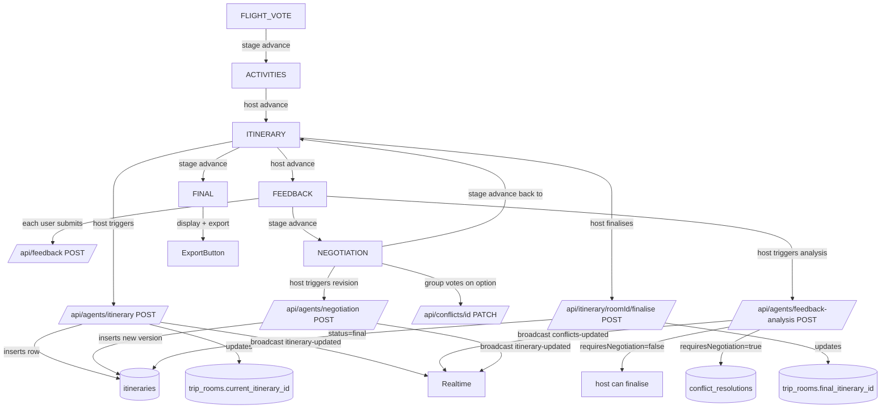
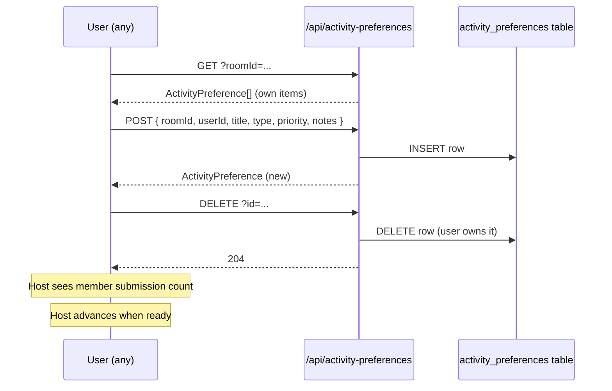
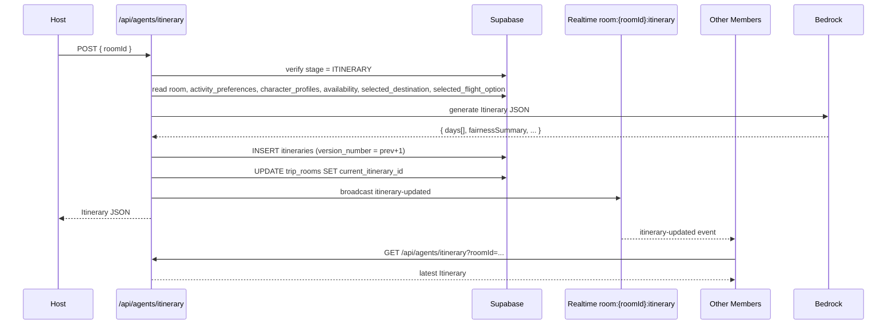
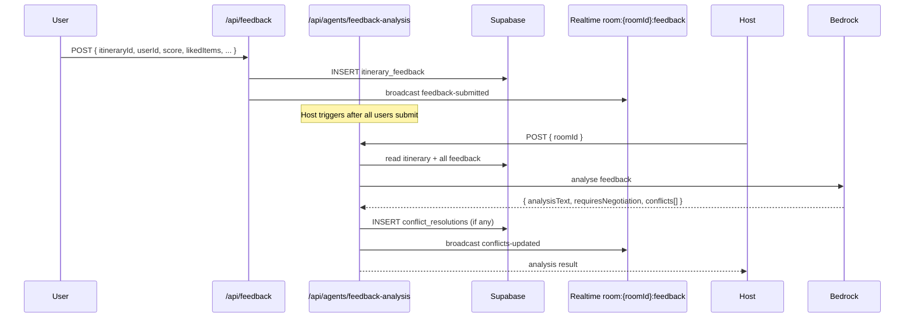
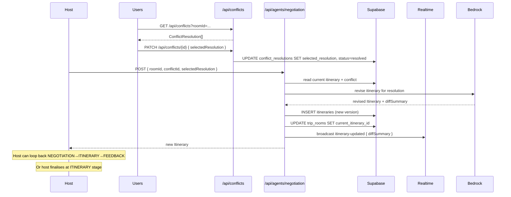

# Design Document: PixelTrip Activities Pipeline

## Overview

This document describes the second half of the PixelTrip planning pipeline:
**ACTIVITIES → ITINERARY → FEEDBACK → NEGOTIATION → FINAL**.

The first half (LOBBY → AVAILABILITY → GROUP_PROFILE → DESTINATIONS → DESTINATION_VOTE → FLIGHTS → FLIGHT_VOTE) is already complete. This pipeline picks up immediately after a flight option has been selected and takes the group through AI-driven itinerary generation, structured feedback collection, conflict negotiation, and final export.

All shared types are already defined in `lib/types.ts`. The DB schema is fully provisioned in `supabase/schema.sql`. This document focuses on component hierarchy, API contracts, agent prompts, data flow, Realtime channels, and the NEGOTIATION revision loop.

---

## Architecture




---

## Stage-by-Stage Component Hierarchy

```
StageRouter.tsx
├── ACTIVITIES  → ActivitiesStage.tsx
│   └── (activity list items rendered inline)
├── ITINERARY   → ItineraryStage.tsx
│   ├── ItineraryDay.tsx  (×N days)
│   └── FairnessSummary.tsx
├── FEEDBACK    → FeedbackStage.tsx
│   └── FeedbackForm.tsx
├── NEGOTIATION → NegotiationStage.tsx
│   └── (conflict cards + VotePanel per conflict)
└── FINAL       → FinalStage.tsx
    ├── ItineraryDay.tsx  (×N days, read-only)
    ├── FairnessSummary.tsx
    └── ExportButton.tsx
```

All stage components receive `StageProps` from `StageRouter.tsx`:

```typescript
interface StageProps {
  room: TripRoom;
  identity: Identity;
  members: User[];
  onRoomUpdated: (updated: TripRoom) => void;
  onGoBack?: () => Promise<void>;
  characterProfiles?: CharacterProfile[];
}
```

---

## Sequence Diagrams

### ACTIVITIES Stage



### ITINERARY Stage — generation flow



### FEEDBACK Stage



### NEGOTIATION Loop




---

## API Contracts

### `POST /api/activity-preferences`

**Request body:**
```typescript
{
  roomId: string;
  userId: string;
  title: string;
  type: "activity" | "food" | "sight" | "experience" | "avoid";
  priority: "must_have" | "optional";
  notes?: string;
}
```

**Response:** `ActivityPreference` (201)

**Errors:** 400 (validation), 404 (room not found), 409 (wrong stage)

---

### `GET /api/activity-preferences?roomId=...`

**Response:** `ActivityPreference[]` for the room, all users

---

### `DELETE /api/activity-preferences?id=...&userId=...`

Deletes a single preference. Validates ownership via `userId`. Returns 204.

---

### `POST /api/agents/itinerary`

**Request body:** `{ roomId: string }`

**Stage gate:** room must be in `ITINERARY`

**Reads from DB:**
- `trip_rooms` — destination, start/end dates, selected_flight_option
- `activity_preferences` — all for this room
- `character_profiles` — all members (falls back to personas if absent)
- `availability` — to confirm travel window
- `room_profiles` — group profile summary

**Agent output shape** (validated before persist):
```typescript
{
  destination: string;
  startDate: string;
  endDate: string;
  days: ItineraryDay[];
  fairnessSummary: FairnessSummary;
}
```

**Persist:** INSERT into `itineraries` with `version_number = MAX(existing)+1` (or 1 if none). UPDATE `trip_rooms.current_itinerary_id`.

**Broadcast:** `itinerary-updated` on channel `room:{roomId}:itinerary`

**Response:** full `Itinerary` (201)

**Errors:** 400, 404, 409 (wrong stage), 412 (missing activity preferences or profile), 500 (agent failure with `{ error, retryable }`)

---

### `GET /api/agents/itinerary?roomId=...`

Returns the latest `Itinerary` (by `version_number` desc) for the room. No agent call. Returns 404 if none exists yet.

---

### `GET /api/itinerary/[roomId]`

Returns all itinerary versions for the room as `Itinerary[]`, sorted by `version_number` ascending (full version history).

---

### `POST /api/itinerary/[roomId]/finalise`

**Request body:** `{ requestingUserId: string }`

**Validation:** `requestingUserId` must be `hostUserId`. Current itinerary must not already be `status=final`.

**Action:** UPDATE `itineraries SET status='final'` for `current_itinerary_id`. UPDATE `trip_rooms SET final_itinerary_id = current_itinerary_id`.

**Response:** `Itinerary` (200)

**Guard:** Once `status=final`, any subsequent POST to `/api/agents/itinerary` for the same room MUST return 409 with `{ error: "Itinerary is finalised" }`.

---

### `POST /api/feedback`

**Request body:**
```typescript
{
  itineraryId: string;
  userId: string;
  score: number;           // 1–10 inclusive, validated
  likedItems: string[];
  dislikedItems: string[];
  requestedAdditions: string[];
  requestedRemovals: string[];
  importantRequests: string[];  // max 3, enforced server-side
}
```

**Validation:** `score` must be integer in [1, 10]. `importantRequests.length <= 3`. Upsert on `(itinerary_id, user_id)`.

**Response:** `ItineraryFeedback` (201)

**Broadcast:** `feedback-submitted` on `room:{roomId}:feedback` (roomId resolved from itinerary row)

---

### `GET /api/feedback/[itineraryId]`

Returns `ItineraryFeedback[]` for the itinerary. Also returns computed `averageScore: number | null` in response envelope:

```typescript
{
  feedback: ItineraryFeedback[];
  averageScore: number | null;
  submittedCount: number;
  totalMembers: number;
}
```

---

### `POST /api/agents/feedback-analysis`

**Request body:** `{ roomId: string }`

**Stage gate:** room must be in `FEEDBACK`

**Reads:** current itinerary (via `trip_rooms.current_itinerary_id`), all feedback for that itinerary

**Agent output shape:**
```typescript
{
  analysisText: string;
  requiresNegotiation: boolean;
  conflicts: Array<{
    conflictSummary: string;
    affectedUsers: string[];       // userId values
    proposedOptions: Array<{
      id: string;
      description: string;
      tradeoffs: string;
    }>;
  }>;
}
```

**Persist:** If `conflicts.length > 0`, INSERT rows into `conflict_resolutions` with `status='open'`.

**Broadcast:** `conflicts-updated` on `room:{roomId}:negotiation`

**Response:**
```typescript
{
  analysisText: string;
  requiresNegotiation: boolean;
  conflicts: ConflictResolution[];
}
```

---

### `GET /api/conflicts?roomId=...`

Returns `ConflictResolution[]` for the room, ordered by `created_at` ascending.

---

### `POST /api/conflicts`

**Request body:** `{ roomId: string, itineraryId: string, conflictSummary: string, affectedUsers: string[], proposedOptions: ConflictOption[] }`

Manually creates a conflict (for testing / edge cases). Returns `ConflictResolution` (201).

---

### `PATCH /api/conflicts/[id]`

**Request body:** `{ selectedResolution: string }`

Sets `selected_resolution` and `status='resolved'` on the conflict.

**Response:** `ConflictResolution` (200)

---

### `POST /api/agents/negotiation`

**Request body:** `{ roomId: string, conflictId: string, selectedResolution: string }`

**Stage gate:** room must be in `NEGOTIATION`

**Reads:** current itinerary (`trip_rooms.current_itinerary_id`), conflict row (to get full context), character_profiles

**Agent instructions:** Revise only the parts of the itinerary affected by the conflict. Preserve all unchanged days/items. Produce a `diffSummary`.

**Agent output shape:**
```typescript
{
  days: ItineraryDay[];
  fairnessSummary: FairnessSummary;
  diffSummary: string;   // plain-language description of what changed
}
```

**Persist:** INSERT new `itineraries` row (version_number = MAX+1). UPDATE `trip_rooms.current_itinerary_id`. UPDATE `conflict_resolutions SET status='resolved'`.

**Broadcast:** `itinerary-updated` on `room:{roomId}:itinerary` with payload `{ diffSummary }`

**Response:** full `Itinerary` plus `diffSummary` field (201)


---

## Agent Prompts and Contracts

### Itinerary Agent — System Prompt

```
You are PixelTrip's itinerary planning expert.
A group of friends has chosen their destination and flight option. Generate a fair, persona-driven day-by-day itinerary for their trip.

Output a single JSON object with EXACTLY these fields (no extras, no omissions):
- destination: string
- startDate: string (ISO date)
- endDate: string (ISO date)
- days: array of ItineraryDay objects
- fairnessSummary: FairnessSummary object

Each ItineraryDay must have:
- date: string (ISO date)
- morning: ItineraryItem[]
- afternoon: ItineraryItem[]
- evening: ItineraryItem[]
- night: ItineraryItem[] (optional, only for nightlife-heavy days)

Each ItineraryItem must have:
- title: string
- description: string (1–2 sentences)
- type: string (e.g. "food", "sight", "activity", "rest")
- personaBenefits: string[] — MUST NOT be empty. List the persona names who specifically benefit from this item.
- reason: string — why this item is included (reference the persona or preference that drove it)

FairnessSummary must have:
- perPersona: Record<personaName, string> — one entry per member
- warnings: string[] — budget concerns, over-packed days, unbalanced coverage
- recommendations: string[] — concrete improvements if any persona is underserved

Non-negotiable rules:
1. Every ItineraryItem.personaBenefits MUST be non-empty — if an item benefits no specific persona, explain why it is included in the reason field.
2. Honor all must_have activity preferences. Include them unless doing so creates a genuine physical impossibility.
3. Respect avoid items — never schedule something a user marked as avoid.
4. Balance pace: if any persona has travelPace=slow, include rest periods.
5. Balance budget: if any persona has budgetLevel=low, avoid luxury-only options without noting alternatives.
6. The fairnessSummary must cover every persona in the group — never omit a member.
7. Return only valid JSON. No preamble, no markdown, no commentary.
```

**User prompt context object:**
```typescript
{
  today: string;
  destination: string;
  startDate: string;
  endDate: string;
  flightOption: "budget" | "comfort" | "best_value";
  groupProfile: GroupProfile;
  members: Array<{
    userId: string;
    displayName: string;
    characterProfile: CharacterProfile | null;
    persona: Persona | null;
  }>;
  activityPreferences: Array<{
    userId: string;
    title: string;
    type: string;
    priority: "must_have" | "optional";
    notes: string | null;
  }>;
}
```

---

### Feedback Analysis Agent — System Prompt

```
You are PixelTrip's feedback analyst.
A group of friends has reviewed a travel itinerary and submitted scores and comments. Analyse the feedback and identify whether the group is satisfied or if conflicts need to be resolved.

Output a single JSON object with EXACTLY these fields:
- analysisText: string — a friendly 2–4 sentence summary of how the group feels about the itinerary
- requiresNegotiation: boolean — true if any of these conditions apply:
    * average score < 6
    * any single score < 4
    * two or more users have directly conflicting requested changes
    * a must-have preference is missing from the itinerary
- conflicts: array of conflict objects (empty array if requiresNegotiation is false)

Each conflict object must have:
- conflictSummary: string — plain-language description of the conflict
- affectedUsers: string[] — userId values of users involved
- proposedOptions: array of exactly 2 or more option objects, each with:
    * id: string (e.g. "option_a", "option_b")
    * description: string — what this option does
    * tradeoffs: string — what each affected user gains or loses

Non-negotiable rules:
1. If requiresNegotiation is true, you MUST produce at least one conflict with at least 2 proposedOptions.
2. Each conflict must name the specific users affected by userId.
3. Keep analysisText friendly and constructive — this is read by a group of friends mid-planning.
4. Return only valid JSON. No preamble, no markdown, no commentary.
```

---

### Negotiation / Revision Agent — System Prompt

```
You are PixelTrip's itinerary revision expert.
A group of friends voted on a conflict resolution option. Revise the existing itinerary to incorporate the chosen resolution, preserving as many unchanged items as possible.

Output a single JSON object with EXACTLY these fields:
- days: ItineraryDay[] — the full revised itinerary days (same structure as itinerary agent output)
- fairnessSummary: FairnessSummary — regenerated to reflect the revised plan
- diffSummary: string — a plain-language 2–4 sentence summary of what changed and why

Non-negotiable rules:
1. Only modify days/items that are directly affected by the chosen resolution. Preserve everything else.
2. Every ItineraryItem.personaBenefits MUST remain non-empty.
3. The diffSummary must specifically name which items were changed, added, or removed.
4. The revised fairnessSummary must cover every persona in the group.
5. Return only valid JSON. No preamble, no markdown, no commentary.
```

**User prompt context for negotiation:**
```typescript
{
  currentItinerary: Itinerary;
  conflict: ConflictResolution;
  chosenOptionId: string;
  chosenOptionDescription: string;
  members: Array<{ userId: string; displayName: string; characterProfile: CharacterProfile | null }>;
}
```


---

## Realtime Channels

All channels use Supabase Realtime broadcast (not presence). The channel name pattern matches existing conventions in the codebase.

| Channel | Event | Payload | Used by |
|---|---|---|---|
| `room:{roomId}:stage` | `stage-change` | `{}` | All stages (existing) |
| `room:{roomId}:itinerary` | `itinerary-updated` | `{ diffSummary?: string }` | ItineraryStage, FinalStage |
| `room:{roomId}:feedback` | `feedback-submitted` | `{ userId: string }` | FeedbackStage |
| `room:{roomId}:negotiation` | `conflicts-updated` | `{}` | NegotiationStage |

**Subscription pattern** (follows existing `DestinationsStage` pattern):

```typescript
useEffect(() => {
  const supabase = createAnonSupabase();
  const ch = supabase.channel(`room:${room.id}:itinerary`);
  ch.on("broadcast", { event: "itinerary-updated" }, ({ payload }) => {
    void fetchItinerary();
    if (payload?.diffSummary) setDiffSummary(payload.diffSummary);
  }).subscribe();
  return () => { void supabase.removeChannel(ch); };
}, [room.id, fetchItinerary]);
```

**Broadcast helper pattern** (matches existing codebase helpers):

```typescript
async function broadcastItineraryUpdated(roomId: string, diffSummary?: string): Promise<void> {
  const supabase = createAnonSupabase();
  const channel = supabase.channel(`room:${roomId}:itinerary`);
  await new Promise<void>((resolve) => {
    channel.subscribe((status) => { if (status === "SUBSCRIBED") resolve(); });
  });
  await channel.send({ type: "broadcast", event: "itinerary-updated", payload: { diffSummary } });
  void supabase.removeChannel(channel);
}
```

---

## Components and Interfaces

### Stage Components

All stage components implement `StageProps` from `StageRouter.tsx`:

```typescript
interface StageProps {
  room: TripRoom;
  identity: Identity;
  members: User[];
  onRoomUpdated: (updated: TripRoom) => void;
  onGoBack?: () => Promise<void>;
  characterProfiles?: CharacterProfile[];
}
```

### Sub-component Interfaces

```typescript
// ItineraryDay.tsx
interface ItineraryDayProps {
  day: ItineraryDay;
  dayNumber: number;
}

// FairnessSummary.tsx
interface FairnessSummaryProps {
  summary: FairnessSummary;
  members: User[];
}

// FeedbackForm.tsx
interface FeedbackFormProps {
  itinerary: Itinerary;
  userId: string;
  existing: ItineraryFeedback | null;
  onSubmitted: (feedback: ItineraryFeedback) => void;
}

// ExportButton.tsx
interface ExportButtonProps {
  itinerary: Itinerary;
  format: "text" | "markdown";
}
```

### Row Mapper Pattern

Every API route maps snake_case Supabase rows to camelCase TypeScript types via explicit mapper functions, following the pattern in `roomHelpers.ts`:

```typescript
function mapItineraryRow(row: ItineraryRow): Itinerary {
  return {
    id: row.id,
    roomId: row.room_id,
    versionNumber: row.version_number,
    destination: row.destination,
    startDate: row.start_date,
    endDate: row.end_date,
    days: row.days as ItineraryDay[],
    fairnessSummary: row.fairness_summary as FairnessSummary,
    averageSatisfactionScore: row.average_satisfaction_score,
    status: row.status,
  };
}

function mapFeedbackRow(row: FeedbackRow): ItineraryFeedback {
  return {
    id: row.id,
    itineraryId: row.itinerary_id,
    userId: row.user_id,
    score: row.score,
    likedItems: row.liked_items as string[],
    dislikedItems: row.disliked_items as string[],
    requestedAdditions: row.requested_additions as string[],
    requestedRemovals: row.requested_removals as string[],
    importantRequests: row.important_requests as string[],
    createdAt: row.created_at,
  };
}

function mapConflictRow(row: ConflictRow): ConflictResolution {
  return {
    id: row.id,
    roomId: row.room_id,
    itineraryId: row.itinerary_id,
    conflictSummary: row.conflict_summary,
    affectedUsers: row.affected_users as string[],
    proposedOptions: row.proposed_options as ConflictOption[],
    selectedResolution: row.selected_resolution,
    status: row.status,
  };
}
```

---

## Data Models

All models are already defined in `lib/types.ts` and the `supabase/schema.sql`. This section summarises the key shapes used by the new pipeline stages.

### ActivityPreference

```typescript
interface ActivityPreference {
  id: string;
  roomId: string;
  userId: string;
  title: string;
  type: "activity" | "food" | "sight" | "experience" | "avoid";
  priority: "must_have" | "optional";
  notes: string | null;
}
```

DB table: `activity_preferences`. Indexed on `room_id`.

### Itinerary

```typescript
interface Itinerary {
  id: string;
  roomId: string;
  versionNumber: number;       // scoped per room, auto-incremented
  destination: string;
  startDate: string;           // ISO date
  endDate: string;             // ISO date
  days: ItineraryDay[];        // stored as JSONB
  fairnessSummary: FairnessSummary;  // stored as JSONB
  averageSatisfactionScore: number | null;  // updated after feedback
  status: "draft" | "final";
}
```

DB constraint: `UNIQUE (room_id, version_number)`. Status transitions: `draft → final` (one-way).

### ItineraryFeedback

```typescript
interface ItineraryFeedback {
  id: string;
  itineraryId: string;
  userId: string;
  score: number;               // 1–10, DB CHECK constraint
  likedItems: string[];        // JSONB
  dislikedItems: string[];     // JSONB
  requestedAdditions: string[]; // JSONB
  requestedRemovals: string[];  // JSONB
  importantRequests: string[];  // JSONB, max 3 enforced at API level
  createdAt: string;
}
```

Upsert on `(itinerary_id, user_id)` — each user has at most one feedback record per itinerary version.

### ConflictResolution

```typescript
interface ConflictResolution {
  id: string;
  roomId: string;
  itineraryId: string;
  conflictSummary: string;
  affectedUsers: string[];     // userId values, JSONB
  proposedOptions: ConflictOption[];  // JSONB, minimum 2
  selectedResolution: string | null;
  status: "open" | "voting" | "resolved";
}
```

### FairnessSummary

```typescript
interface FairnessSummary {
  perPersona: Record<string, string>;  // personaName → coverage summary
  warnings: string[];
  recommendations: string[];
}
```

Stored as JSONB within the `itineraries` row. Every room member must have an entry in `perPersona`.

---

## Testing Strategy

### Unit Testing Approach

Each API route should be tested for:
- Valid inputs return correct HTTP status and response shape
- Invalid/missing fields return 400
- Wrong room stage returns 409
- Finalised-itinerary guard returns 409 for POST `/api/agents/itinerary`
- Ownership guard on DELETE `/api/activity-preferences` returns 403/404

### Property-Based Testing Approach

**Property Test Library:** fast-check (already used in project)

Key properties to test:
- For any valid `ActivityPreference` batch, the itinerary agent context contains every submitted preference
- For any `ItineraryFeedback` with `score` in [1, 10], the average score computation is correct
- For any `importantRequests` array with length ≤ 3, the POST succeeds; length > 3 always returns 400

### Integration Testing Approach

Manual smoke-test path covers the full pipeline:
1. Advance room to ACTIVITIES → submit preferences as multiple users
2. Advance to ITINERARY → generate itinerary → verify all days rendered
3. Advance to FEEDBACK → submit scores → trigger analysis
4. Advance to NEGOTIATION → select resolution → trigger revision
5. Back to ITINERARY → finalise → advance to FINAL → export

---

## Component Designs

### ActivitiesStage.tsx

**Purpose:** Let each user build their activity wish-list before the itinerary is generated.

**State:**
- `preferences: ActivityPreference[]` — fetched on mount, filtered to own userId for display
- `allPreferences: ActivityPreference[]` — full room list, shown as read-only to show group coverage
- `submitting: boolean`
- `error: string | null`

**Behaviour:**
- GET `/api/activity-preferences?roomId=...` on mount — loads all preferences for the room
- Each user sees their own items in an editable list and other members' items as read-only chips
- Add form: title input, type selector (activity/food/sight/experience/avoid), priority toggle (must_have/optional), optional notes
- Delete own items only
- Host sees a count of how many members have submitted at least one preference
- Host can advance stage at any time (even if some members haven't submitted)
- Subscribe to `room:{roomId}:stage` for stage-change events

**UI elements:** Pixel-style add form, color-coded chips per type (activity=sky-blue, food=orange, sight=green, experience=purple, avoid=red), priority badge

---

### ItineraryStage.tsx

**Purpose:** Display the generated itinerary with fairness summary. Host can trigger generation and advance.

**State:**
- `itinerary: Itinerary | null`
- `loading: boolean`
- `generating: boolean`
- `error: string | null`
- `diffSummary: string | null` — populated after a revision, shown as a banner
- `allVersions: Itinerary[]` — for version history dropdown

**Behaviour:**
- GET `/api/agents/itinerary?roomId=...` on mount
- If none and host: show "Generate itinerary" button → POST `/api/agents/itinerary`
- If none and member: show waiting state
- Subscribe to `room:{roomId}:itinerary` → on `itinerary-updated`, re-fetch and show diffSummary banner
- Host can finalise: POST `/api/itinerary/{roomId}/finalise` → sets status=final then advance to FINAL stage
- Host can advance to FEEDBACK without finalising (for revision loop)
- Version history: dropdown showing all versions; selecting one shows that version read-only
- Show `averageSatisfactionScore` if present (populated after feedback round)

**Sub-components used:**
- `ItineraryDay` — renders each day
- `FairnessSummary` — renders the fairness breakdown

---

### FeedbackStage.tsx

**Purpose:** Each user scores the itinerary and submits change requests.

**State:**
- `itinerary: Itinerary | null` — loaded on mount (current version)
- `myFeedback: ItineraryFeedback | null` — already-submitted feedback for this user
- `allFeedback: { feedback: ItineraryFeedback[], averageScore: number | null, submittedCount: number, totalMembers: number }` — host view
- `analysisResult: { analysisText, requiresNegotiation, conflicts } | null`
- `analysing: boolean`

**Behaviour:**
- GET itinerary, GET `/api/feedback/{itineraryId}` on mount
- Subscribe to `room:{roomId}:feedback` → on `feedback-submitted`, re-fetch allFeedback counts
- If user already submitted: show read-only summary + allow edit
- FeedbackForm handles POST `/api/feedback`
- Host sees all submission counts + average score
- When avg < 6: warning banner "Average satisfaction is low — consider triggering a revision"
- When any score < 4: highlight that member's row
- Host can trigger analysis: POST `/api/agents/feedback-analysis`
- If `requiresNegotiation=false` and host is satisfied: host can advance to FINAL directly
- If `requiresNegotiation=true`: show conflicts preview, advance to NEGOTIATION

---

### FeedbackForm.tsx

**Purpose:** Score input + amendment request form used inside FeedbackStage.

**Props:**
```typescript
interface FeedbackFormProps {
  itinerary: Itinerary;
  userId: string;
  existing: ItineraryFeedback | null;
  onSubmitted: (feedback: ItineraryFeedback) => void;
}
```

**Fields:**
- Score slider 1–10 with visual indicators (green ≥7, amber 5–6, red ≤4)
- Liked items: multi-select from itinerary item titles + free text
- Disliked items: same
- Requested additions: free text tags (add/remove)
- Requested removals: free text tags
- Important requests: up to 3 items (enforced client-side with counter)
- Submit button

---

### NegotiationStage.tsx

**Purpose:** Show AI-identified conflicts with proposed options. Group votes. Host triggers revision.

**State:**
- `conflicts: ConflictResolution[]`
- `itinerary: Itinerary | null` — current version
- `revising: boolean`
- `revisionError: string | null`

**Behaviour:**
- GET `/api/conflicts?roomId=...` on mount
- GET current itinerary on mount
- Subscribe to `room:{roomId}:negotiation` → on `conflicts-updated`, re-fetch conflicts
- Subscribe to `room:{roomId}:itinerary` → on `itinerary-updated`, re-fetch + show diffSummary
- Each conflict card shows: summary, affected users, 2+ option cards with tradeoffs
- Any user can select an option (sets `selectedResolution` via PATCH `/api/conflicts/{id}`)
- Host triggers revision: POST `/api/agents/negotiation { roomId, conflictId, selectedResolution }`
- After revision: new itinerary displayed inline with diffSummary banner
- Host can continue loop: advance back to ITINERARY, or skip to FEEDBACK for another round
- Host can advance to ITINERARY at any time (to view revised itinerary and potentially finalise)

---

### FinalStage.tsx

**Purpose:** Display the finalised itinerary in a clean format with export options.

**State:**
- `itinerary: Itinerary | null` — `finalItineraryId` version, status=final
- `copied: boolean` — clipboard feedback

**Behaviour:**
- GET using `room.finalItineraryId` → `/api/itinerary/{roomId}` then find the final version
- Read-only — no editing controls
- `ExportButton` copies text/markdown to clipboard
- Show final fairness summary, destination, dates, flight category, all days

---

### FairnessSummary.tsx

**Props:**
```typescript
interface FairnessSummaryProps {
  summary: FairnessSummary;
  members: User[];
}
```

Renders per-persona cards, warnings in amber, recommendations in sky-blue.

---

### ItineraryDay.tsx (sub-component)

**Props:**
```typescript
interface ItineraryDayProps {
  day: ItineraryDay;
  dayNumber: number;
}
```

Renders morning/afternoon/evening/night sections with item cards. Each card shows title, description, type icon, persona benefit badges, and reason.

---

### ExportButton.tsx

**Props:**
```typescript
interface ExportButtonProps {
  itinerary: Itinerary;
  format: "text" | "markdown";
}
```

Copies formatted itinerary to clipboard. Shows tick icon for 2s after copy. Handles clipboard API failure gracefully with fallback `<textarea>` select.


---

## Data Flow — NEGOTIATION Loop Detail

The NEGOTIATION → ITINERARY → FEEDBACK cycle is supported by the existing stage machine. Here is the exact state machine path:

```
FEEDBACK
  │
  ├─ (requiresNegotiation=false AND host satisfied)
  │    └─→ host advances to FINAL directly
  │
  └─ (requiresNegotiation=true OR host wants revision)
       └─→ host advances to NEGOTIATION
             │
             ├─ group votes on conflict resolution
             │
             └─ host triggers negotiation agent → new itinerary version
                  │
                  └─ host advances NEGOTIATION → ITINERARY (via "back" or stage PATCH)
                        │
                        ├─ review new itinerary
                        │
                        ├─ host finalises → FINAL
                        │
                        └─ host advances to FEEDBACK for another round
                              └─ (loop repeats)
```

**Stage transition rules for the loop:**
- `PATCH /api/rooms/{code}/stage` (forward): NEGOTIATION → ITINERARY uses existing `getNextStage` but ITINERARY comes BEFORE FEEDBACK in the stage order, so going NEGOTIATION → ITINERARY requires going backwards.
- The `onGoBack` callback in `StageProps` covers this: from NEGOTIATION, "go back" moves to ITINERARY, and from ITINERARY "advance" moves to FEEDBACK.
- The existing `getPreviousStage()` / `getNextStage()` helpers in `roomHelpers.ts` already support this.

**Version number strategy:**
- `version_number` is scoped per `room_id` with a unique constraint on `(room_id, version_number)`.
- Each new generation or revision reads `MAX(version_number) WHERE room_id = ?` and inserts `MAX + 1`.
- The `itineraries` table does not delete old versions — all are preserved for history.

---

## Error Handling

| Scenario | HTTP Status | Response |
|---|---|---|
| Wrong stage | 409 | `{ error: "Room is not in X stage (current: Y)" }` |
| Room not found | 404 | `{ error: "Room not found" }` |
| Missing prerequisite data | 412 | `{ error: "...", retryable: false }` |
| Agent parse failure (after retry) | 500 | `{ error: "Agent failed", retryable: true }` |
| Agent Bedrock error | 500 | `{ error: "...", retryable: true }` |
| Finalise non-host | 403 | `{ error: "Only the host can finalise the itinerary" }` |
| Finalise already-final | 409 | `{ error: "Itinerary is already finalised" }` |
| Score out of range | 400 | `{ error: "Score must be between 1 and 10" }` |
| importantRequests > 3 | 400 | `{ error: "Maximum 3 important requests allowed" }` |
| Generate on finalised room | 409 | `{ error: "Itinerary is finalised" }` |

---

## Correctness Properties

These properties must hold at all times in the system:

### Property 1: Activity preferences are user-scoped and agent-accessible

For all `ap` in `activity_preferences`: `ap.user_id` maps to a user in the same room. POST to `/api/agents/itinerary` reads ALL `activity_preferences` for the room and includes them in the agent context — none are silently dropped.

**Validates: Requirements 8, 9**

### Property 2: Every ItineraryItem has non-empty personaBenefits

For all `item` in `itinerary.days[*].morning | afternoon | evening | night`: `item.personaBenefits.length >= 1`. The agent system prompt explicitly requires this; the route validates it before persisting.

**Validates: Requirements 9**

### Property 3: FairnessSummary covers every room member

For all `userId` in `users WHERE room_id = X`: there exists a key in `fairnessSummary.perPersona` for that user's persona name. The agent prompt lists all member names explicitly; the route validates `Object.keys(fairnessSummary.perPersona).length >= memberCount`.

**Validates: Requirements 10**

### Property 4: Feedback score is 1–10 inclusive

`score >= 1 AND score <= 10` enforced by DB CHECK constraint AND API validation. Any POST with score outside this range returns 400 before touching the DB.

**Validates: Requirements 11**

### Property 5: ConflictResolution has at least 2 proposedOptions

For all `cr` in `conflict_resolutions`: `cr.proposed_options` (JSONB array) has length >= 2. The feedback-analysis agent system prompt requires ≥2 options; the route validates before persisting.

**Validates: Requirements 13**

### Property 6: Finalised itinerary cannot be overwritten

If `itineraries.status = 'final'` for `trip_rooms.current_itinerary_id`, then POST to `/api/agents/itinerary` returns 409. This check happens BEFORE the agent is invoked — no Bedrock call is made.

**Validates: Requirements 14, 15**

---

## Performance Considerations

- Agent calls (itinerary, feedback-analysis, negotiation) are Bedrock calls and take 10–30 seconds. All three show loading states with descriptive copy.
- Only the host triggers agent calls — members see waiting states and receive results via Realtime broadcast.
- Itinerary version history is fetched lazily (only when user opens the version dropdown).
- `GET /api/feedback/{itineraryId}` returns aggregate counts alongside raw feedback to avoid N+1 queries in the client.

## Security Considerations

- All agent routes are server-side only. No Bedrock credentials reach the browser.
- `activity-preferences` DELETE validates `userId` ownership before deleting.
- `/api/itinerary/{roomId}/finalise` validates `requestingUserId === room.hostUserId` before acting.
- Stage gates on all agent routes prevent out-of-order invocations.
- No auth is used per product design — identity is a localStorage UUID.

## Dependencies

All dependencies are already in the project:
- `next` 14 (App Router)
- `@supabase/supabase-js` (Supabase client + Realtime)
- `@aws-sdk/...` / Bedrock via `lib/bedrock.ts`
- `tailwindcss`
- All types from `lib/types.ts`
- All DB tables already provisioned in `supabase/schema.sql`
